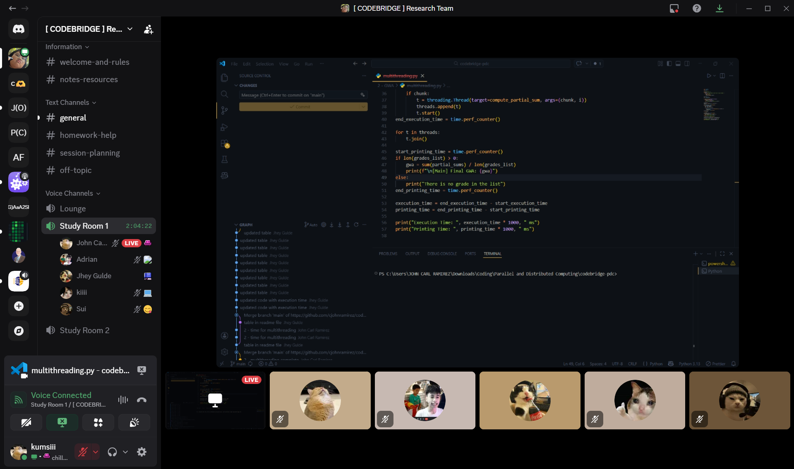
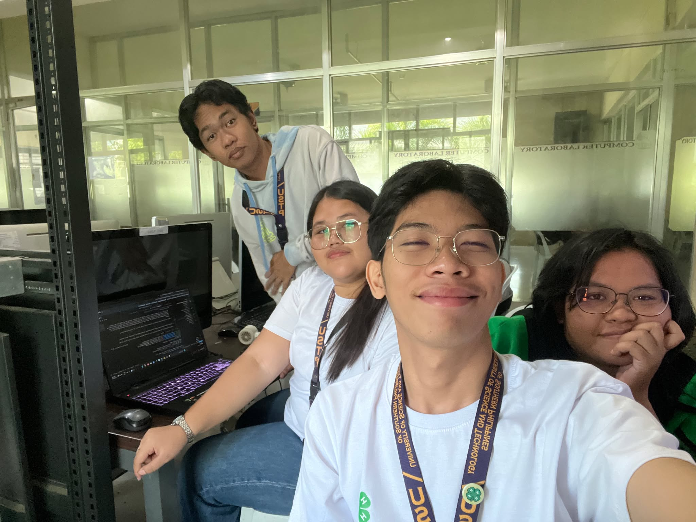
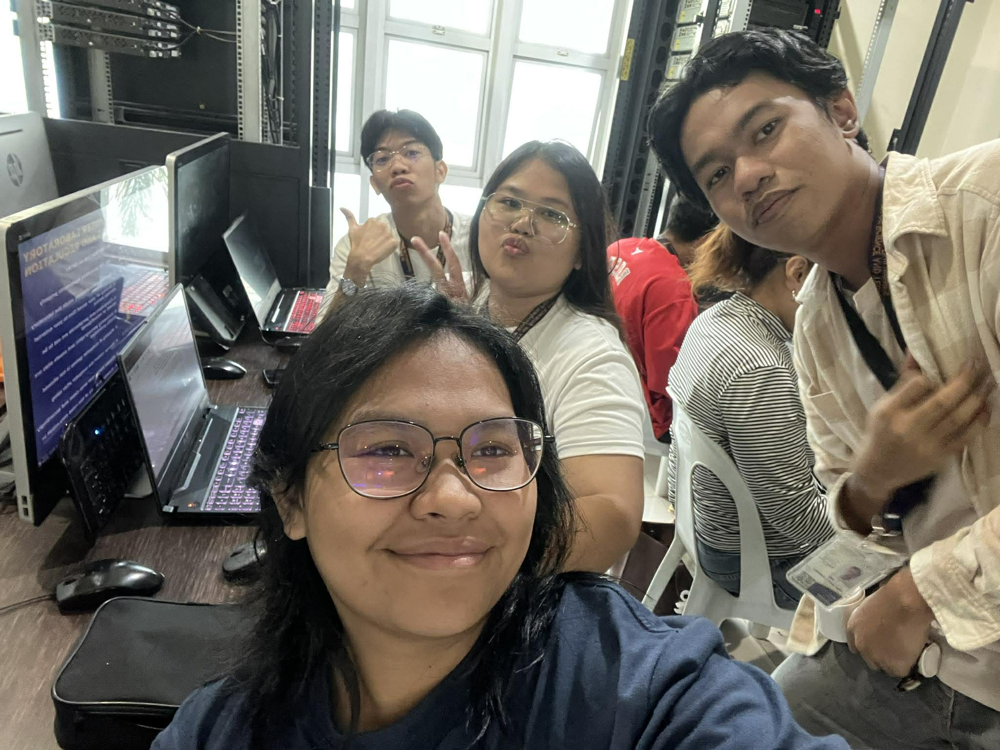

# codebridge-pdc

> A unified Codespace repository for the subject **CS323 - Parallel and Distributed Computing**

**Computer Science - 3A**  
University of Science and Technology of Southern Philippines  
Department of Computer Science

### Team Members
- **Campion, Gerlie**
- **Esteban, Francis Adrian**
- **Gulde, Jhey**
- **Gultiano, Kathleen Grace**
- **Ramirez, John Carl**

---

## Repository Contents

| Directory | Description |
| :--- | :--- |
| **[1 - Calculator](./1%20-%20Calculator)** | Basic arithmetic operations demonstrating Python fundamentals. |
| **[2 - GWA](./2%20-%20GWA)** | Comparative analysis of **Multithreading** vs **Multiprocessing** for GWA calculation. |
| **[3 - Concurrency](./3%20-%20Concurrency)** | Payroll system implementation utilizing **Task** and **Data Parallelism**. |
| **[4 - Analog](./4%20-%20Analog)** | Computational simulation of a real-world bottleneck utilizing **Data Parallelism**. |
---

## Documentation

### 1st Meeting - 1/17/2026

### 2nd Meeting - 2/07/2026

### 3rd Meeting - 2/14/2026

## 4th Meeting - 2/21/2026

